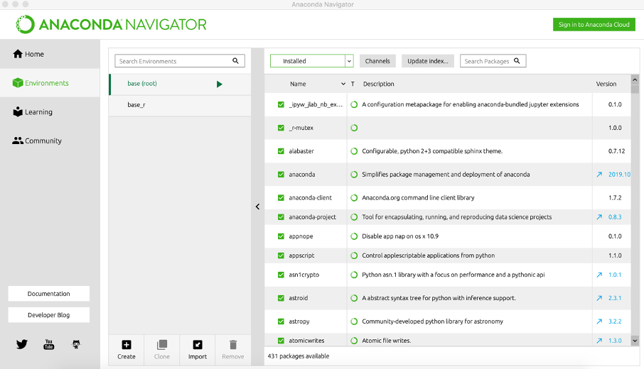

# Designing a «Digital Twin» of a Radio Telescope - Dash Application

## Application Instructions
These instructions explain how to start the Dash-application to visualize the radio images created by SATRO.
After cloning the repository to your local machine, follow these steps.

### 1. Make sure you have Python installed
To execute the initial script, you must have Python installed on your operating system.

https://www.python.org/downloads/

Python version 3.7 is sufficient for execution.

### 2. Make sure you have important packages installed
Make sure that you have certain packages installed for executing this application.
To easy manage your packages you can navigate with Anaconda, a graphical user interface for managing packages and environments.

#### To install it:
https://docs.anaconda.com/anaconda/install/

#### To getting started with:
https://docs.anaconda.com/anaconda/navigator/getting-started/

Easly add packages via the navigator:



The following packages are required for this application:
- matplotlib
- plotly
- plotly-express
- astropy
- pandas
- numpy
- dash
- dash-core-components
- dash-bootstrap-components
- dash-html-components

### 3. Execute script and open Dash-App
Firstly start your terminal at this folder:

dt_radio_telescope_dashapp/AppDash

To simply start the application you have to enter
```
python app.py
```

Afterwards it will show you the localhost adress where the application is running.
